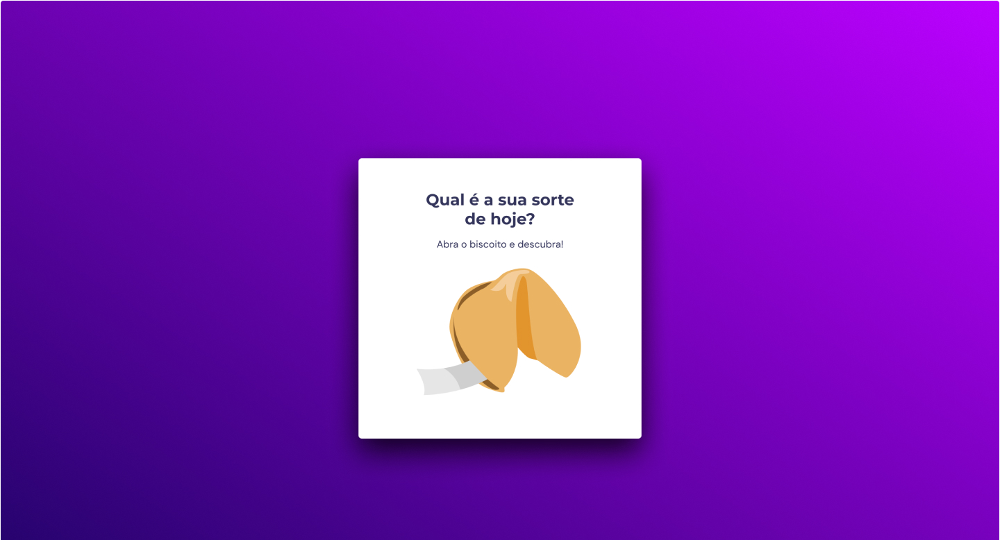

<h1 align="center"> Stage 05 - Biscoito da Sorte</h1>

 

  

## 🖥️ Tecnologias

Esse projeto foi desenvolvido com as seguintes tecnologias:

- HTML
- CSS
- Javascript
- Git e Github
- Figma

## 📂 Projeto

 Neste desafio foi criado um jogo chamado Biscoito da Sorte, no qual o usuário, a partir de um clique ou enter, abre um biscoito com a sua sorte do dia. Os tópicos abordados neste projeto são:

- Estrutura de dados HTML
- Animações com CSS
- Funções no Javascript
- Manipulação da DOM
- Biblioteca JS Math()
- Funções _callback_
- Arrays

 

## 🔖 Layout

Você pode visualizar o layout do projeto através [DESSE LINK](https://www.figma.com/community/file/1182751789348533739). É necessário ter conta no [Figma](https://figma.com) para acessá-lo.

  

